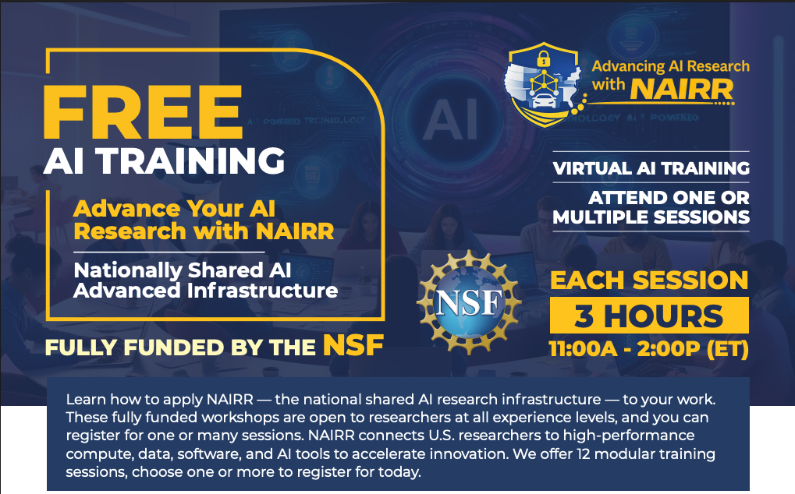

| # | Workshop | GitHub Repository | Jupyter Notebook | Download Slides Materials |
|---|----------|------------------|------------------|---------------------------|
| 1 | Introduction to NAIRR: Tools and Project Walkthrough |  |  |  |
| 2 | AI for Cybersecurity: Threats and Defenses |  |  |  |
| 3 | Security of AI Development Using NAIRR |  |  |  |
| 4 | Efficient Inference for Edge AI | [Workshop_EdgeAI](https://github.com/lc-leonardo/Workshop_EdgeAI) |  |  |
| 5 | Domain-Specific Optimization in Edge AI | [Workshop_EdgeAI](https://github.com/lc-leonardo/Workshop_EdgeAI) |  |  |
| 6 | AI for Autonomous Driving |  |  |  |
| 7 | AI-Enabled Sensing and Controlling |  |  |  |
| 8 | Case Study: Edge AI and Cybersecurity in Action |  |  |  |
| 9 | Case Study: Cybersecurity in Autonomous Driving |  |  |  |
| 10 | Case Study: Real-time Control and Decision-Making with Edge AI |  |  |  |
| 11 | Combined Case Study: Cybersecurity, Edge AI and Autonomous Driving |  |  |  |
| 12 | Key Takeaways and Future Directions |  |  |  |
